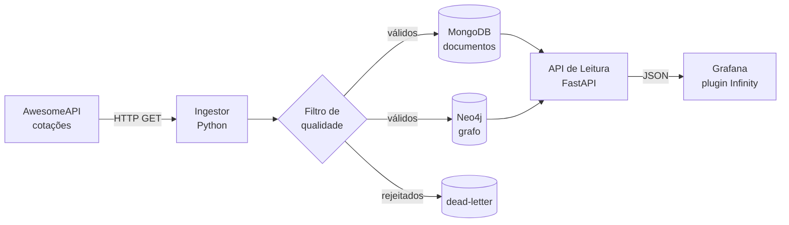

# Prática Multiagente — Pipeline de Câmbio com MongoDB + Neo4j + Grafana

**Disciplina:** Tópicos Integradores I — Sistemas de Informação
**Ambiente:** GitHub Codespaces + GitHub Copilot (plano Student/Education)
**Tema:** consumir cotações de câmbio de uma API pública, filtrar, gravar nos dois bancos
NoSQL e visualizar no Grafana — tudo construído por **agentes de IA** coordenados por você.

> **Objetivo pedagógico:** mostrar a alunos iniciantes que **o mesmo dado** vira coisas
> diferentes em um banco de **documento** (MongoDB) e em um banco de **grafo** (Neo4j), e
> aprender o **método multiagente** (documentos curtos, validação humana entre etapas).

---

## 1. Como esta prática funciona (visão de 1 minuto)

Você **não pede tudo de uma vez** para a IA. Em vez disso, conduz **seis agentes
especializados**, um de cada vez, validando o resultado antes de avançar:

```
Arquiteto -> Designer de API -> Engenheiro de Dados -> Eng. de Visualização -> QA -> Documentador
```

Cada agente lê só os arquivos do seu papel, escreve só o que lhe cabe, e termina com um
"RESUMO PARA VALIDAÇÃO HUMANA". Você (humano) aprova e libera o próximo. As regras estão
em `docs/00_orientacao_agentes.md`; os papéis e prompts em `prompts/`.

### O que a aplicação faz (arquitetura)



**Por que uma API de leitura no meio?** O Grafana OSS (gratuito) não lê MongoDB
nativamente. A API (FastAPI) expõe os dois bancos como JSON e o Grafana consome pelo
plugin **Infinity** (gratuito) — e os alunos ainda aprendem a camada de API.

---

## 2. Estrutura do repositório

```
pratica-multiagente/
├── .devcontainer/devcontainer.json     # ambiente do Codespaces (Docker-in-Docker)
├── .github/copilot-instructions.md     # regras lidas pelo Copilot em toda sessão
├── docker-compose.yml                  # orquestra os 5 serviços
├── .env.example                        # variáveis (copiar para .env)
├── docs/                               # a "metodologia": 00 a 09
│   ├── 00_orientacao_agentes.md        #   regras gerais (todos leem antes)
│   ├── 01_visao_geral.md               #   escopo
│   ├── 02_requisitos_e_regras_de_negocio.md
│   ├── 03_modelagem_dados.md           #   Mongo (documento) vs Neo4j (grafo)
│   ├── 04_contratos_de_api.md          #   contrato da API de leitura
│   ├── 05_desenvolvimento_ingestao_modulo.md
│   ├── 06_desenvolvimento_visualizacao_modulo.md
│   ├── 07_plano_de_testes.md
│   ├── 08_log_de_evolucao.md           #   memória do projeto
│   └── 09_glossario_dominio.md
├── prompts/                            # os 6 prompts especializados
├── ingestor/                           # coleta + filtro + cargas (agentes preenchem)
├── api_leitura/                        # FastAPI (agentes preenchem)
└── grafana/provisioning/               # datasource + dashboards
```

> **Importante:** `ingestor/` e `api_leitura/` já vêm com **esqueletos que sobem** (para
> validar a infra). Os agentes substituem esses esqueletos pelo código real. A
> **infraestrutura** (Docker/Codespaces) já está pronta para você não travar no começo.

---

## 3. Pré-requisitos

- Conta no GitHub com **GitHub Copilot** habilitado (plano Student via GitHub Education).
- Acesso ao **GitHub Codespaces** (incluído no plano Education, com cota de horas).
- Nada para instalar na sua máquina: tudo roda no navegador.

---

## 4. Passo a passo COMPLETO — do zero ao sistema em uso

### Etapa 1 — Subir o repositório para o GitHub

1. Crie um repositório novo no GitHub (ex.: `pratica-multiagente`).
2. Envie **todo o conteúdo desta pasta** para ele (via `git push` ou upload pela web).
3. Confirme que `.github/copilot-instructions.md`, `docs/`, `prompts/` e
   `docker-compose.yml` estão lá.

### Etapa 2 — Abrir o Codespace

1. No repositório, clique em **`Code` -> aba `Codespaces` -> `Create codespace on main`**.
2. Aguarde o ambiente montar (a primeira vez demora alguns minutos). O VS Code abre no
   navegador com o repositório já carregado e o Docker pronto (Docker-in-Docker).

### Etapa 3 — Configurar o Copilot Chat

1. Abra o painel do **Copilot Chat** na barra lateral.
2. Confirme que o seletor de modelo está em **`Auto`**. No plano Student **não** dá para
   escolher modelos premium manualmente — e tudo bem: a diferença entre agentes vem do
   **prompt** e do **isolamento por sessão**, não do modelo.
3. O arquivo `.github/copilot-instructions.md` é lido automaticamente em toda sessão.

### Etapa 4 — Rodar os agentes, um de cada vez

Esta é a parte central da prática. Você vai conduzir **6 agentes em sequência**. Cada um
roda em uma **sessão de chat separada** e recebe, como primeira mensagem, sempre 3 partes
na mesma ordem:

1. **O prompt do agente** — copie o conteúdo do arquivo correspondente da pasta `prompts/`.
2. **Os arquivos de leitura** — anexe-os digitando `#file:` seguido do caminho. No Copilot
   Chat, ao digitar `#file:` aparece uma lista; selecione o arquivo. Anexe **somente** os
   que estão indicados para aquele agente (isso mantém o foco e economiza cota).
3. **A tarefa imediata** — o que ele deve produzir agora.

**Como abrir cada sessão (repita para os 6 agentes):**

1. No Copilot Chat, clique no **`+`** para abrir uma **nova conversa** (não reaproveite a
   anterior — cada agente precisa começar "limpo").
2. **Renomeie** a conversa com o nome do agente (ex.: `Agente Arquiteto`), para você não se
   perder.
3. **Cole o bloco inicial** correspondente (abaixo) e envie.
4. Quando o agente terminar, leia o bloco **"RESUMO PARA VALIDAÇÃO HUMANA"**, confira a
   entrega, e só então faça `git add` + `git commit`.
5. Passe para o próximo agente.

> **Regra de ouro:** só ative o próximo agente depois de validar e **commitar** o resultado
> do anterior. Se um agente travar com dúvida, ele abre uma **divergência** (ver `docs/00`,
> seção 6) — você decide e segue.

Os blocos abaixo são para **copiar e colar**. Onde aparecer `[cole aqui o conteúdo de
prompts/...]`, abra o arquivo indicado e cole o texto dele no lugar dessa linha.

---

#### Ciclo 1 — Agente Arquiteto

```text
[cole aqui o conteúdo de prompts/agente_arquiteto.md]

Contexto desta sessão:
- Fase atual: arquitetura
- Iteração: primeira

Arquivos de leitura obrigatória:
#file:docs/00_orientacao_agentes.md
#file:docs/09_glossario_dominio.md
#file:docs/01_visao_geral.md
#file:docs/02_requisitos_e_regras_de_negocio.md
#file:docs/03_modelagem_dados.md

Tarefa imediata:
Valide os requisitos (02) e a modelagem (03), aponte riscos e lacunas, e confirme se a
infraestrutura (docker-compose.yml e .devcontainer) atende ao escopo. Liste premissas e
riscos antes de decidir.
```

**Pronto quando:** requisitos e modelagem estão coerentes e a infra está aprovada.

---

#### Ciclo 2 — Agente Designer de API

```text
[cole aqui o conteúdo de prompts/agente_designer_api.md]

Contexto desta sessão:
- Fase atual: contrato da API de leitura
- Iteração: primeira

Arquivos de leitura obrigatória:
#file:docs/00_orientacao_agentes.md
#file:docs/09_glossario_dominio.md
#file:docs/02_requisitos_e_regras_de_negocio.md
#file:docs/03_modelagem_dados.md
#file:docs/04_contratos_de_api.md

Tarefa imediata:
Revise e complete o contrato em 04, garantindo que cada endpoint tem um exemplo REAL de
resposta em JSON e que o formato é amigável ao plugin Infinity do Grafana. Destaque
qualquer ambiguidade que precise de decisão antes do desenvolvimento.
```

**Pronto quando:** cada endpoint do `04` tem exemplo real e não há ambiguidade aberta.

---

#### Ciclo 3 — Agente Engenheiro de Dados

```text
[cole aqui o conteúdo de prompts/agente_engenheiro_dados.md]

Contexto desta sessão:
- Fase atual: implementação do ingestor e da API de leitura
- Iteração: primeira

Arquivos de leitura obrigatória:
#file:docs/00_orientacao_agentes.md
#file:docs/09_glossario_dominio.md
#file:docs/03_modelagem_dados.md
#file:docs/04_contratos_de_api.md
#file:docs/05_desenvolvimento_ingestao_modulo.md

Tarefa imediata:
Implemente os arquivos de ingestor/ (main.py, filtros.py, carga_mongo.py, carga_neo4j.py)
e api_leitura/main.py, seguindo estritamente o contrato 04 e a modelagem 03. Inclua os
testes do filtro (ingestor/test_filtros.py) e termine com o bloco EVIDÊNCIAS mostrando a
saída do pytest.
```

**Pronto quando:** o filtro barra um dado ruim, os dois bancos gravam e os testes passam.

---

#### Ciclo 4 — Agente Engenheiro de Visualização

```text
[cole aqui o conteúdo de prompts/agente_engenheiro_visualizacao.md]

Contexto desta sessão:
- Fase atual: dashboard do Grafana
- Iteração: primeira

Arquivos de leitura obrigatória:
#file:docs/00_orientacao_agentes.md
#file:docs/09_glossario_dominio.md
#file:docs/04_contratos_de_api.md
#file:docs/06_desenvolvimento_visualizacao_modulo.md

Tarefa imediata:
Gere o grafana/provisioning/dashboards/cambio.json completo, com os painéis de série
temporal, cards, tabela e grafo (Node Graph), consumindo a API de leitura via datasource
Infinity. O dashboard deve subir provisionado, sem login nem importação manual.
```

**Pronto quando:** ao abrir a porta 3000, o dashboard aparece populado.

---

#### Ciclo 5 — Agente de QA

```text
[cole aqui o conteúdo de prompts/agente_qa.md]

Contexto desta sessão:
- Fase atual: testes e validação
- Iteração: primeira

Arquivos de leitura obrigatória:
#file:docs/00_orientacao_agentes.md
#file:docs/09_glossario_dominio.md
#file:docs/02_requisitos_e_regras_de_negocio.md
#file:docs/04_contratos_de_api.md
#file:docs/07_plano_de_testes.md

Tarefa imediata:
Execute o plano de testes do 07 sobre o que foi implementado. Para cada falha, registre o
passo a passo de reprodução e a severidade. Não corrija o código: registre e devolva ao
agente responsável. Anexe também os arquivos de código que precisar revisar.
```

**Pronto quando:** os testes passam, com evidência registrada.

---

#### Ciclo 6 — Agente Documentador

```text
[cole aqui o conteúdo de prompts/agente_documentador.md]

Contexto desta sessão:
- Fase atual: consolidação do log de evolução
- Iteração: primeira

Arquivos de leitura obrigatória:
#file:docs/00_orientacao_agentes.md
#file:docs/09_glossario_dominio.md
#file:docs/08_log_de_evolucao.md

Tarefa imediata:
Atualize o 08 com as entradas de cada ciclo já validado (agente, data, artefato, validador
e status) e mantenha o 09 consistente. Cole, junto desta mensagem, os blocos "RESUMO PARA
VALIDAÇÃO HUMANA" produzidos pelos outros agentes para que você registre o que foi feito.
```

**Pronto quando:** o `08` registra cada ciclo e o `09` está consistente.

---

**Resumo dos ciclos:**

| # | Agente | Prompt | Entrega |
|---|---|---|---|
| 1 | **Arquiteto** | `prompts/agente_arquiteto.md` | revisa `02`, `03` e a infra |
| 2 | **Designer de API** | `prompts/agente_designer_api.md` | fecha `04` |
| 3 | **Engenheiro de Dados** | `prompts/agente_engenheiro_dados.md` | `ingestor/` e `api_leitura/` + testes |
| 4 | **Eng. de Visualização** | `prompts/agente_engenheiro_visualizacao.md` | `grafana/.../cambio.json` |
| 5 | **QA** | `prompts/agente_qa.md` | executa o `07` |
| 6 | **Documentador** | `prompts/agente_documentador.md` | atualiza `08`/`09` |

### Etapa 5 — Rodar a aplicação

No terminal do Codespace:

```bash
cp .env.example .env          # cria as variáveis (ajuste a senha do Neo4j se quiser)
docker compose up --build     # sobe os 5 serviços
```

A primeira subida baixa as imagens e demora. Quando estabilizar, o ingestor começa a
coletar a cada `INTERVALO_SEGUNDOS`.

### Etapa 6 — Abrir e usar o sistema

Na aba **`PORTS`** do Codespace, abra no navegador:

| Porta | Serviço | O que ver |
|---|---|---|
| **3000** | **Grafana** | dashboard "Câmbio NoSQL" (sem login) |
| **8000** | **API de leitura** | `/health` e `/docs` (Swagger) |
| **7474** | **Neo4j Browser** | usuário `neo4j`, senha do `.env`; rode os Cypher do `03` |
| 27017 | MongoDB | (uso interno; consulte via terminal `mongosh` se quiser) |

**Verificação rápida de que está tudo funcionando:**

```bash
curl http://localhost:8000/health                       # {"status":"ok"}
curl "http://localhost:8000/mongo/resumo"                # lista de pares com cotação
docker compose logs -f ingestor                          # ver os ciclos de coleta
```

### Etapa 7 — Encerrar (preserve sua cota)

```bash
docker compose down          # para os serviços (mantém os dados nos volumes)
```

E **pare o Codespace** (menu inferior esquerdo -> *Stop Current Codespace*) ao terminar —
o plano Education tem cota de horas.

---

## 5. Roteiro de aula sugerido (sequência didática)

1. Abrir o Codespace e rodar `docker compose up` — todos veem os 5 serviços subindo.
2. Mostrar a resposta crua da AwesomeAPI no navegador.
3. Mostrar a **mesma cotação** dentro do Mongo (documento) e dentro do Neo4j (grafo).
4. Rodar uma agregação no Mongo e um `shortestPath` no Neo4j — sentir a diferença.
5. Abrir o Grafana e ver os dois bancos lado a lado.
6. Mostrar a coleção *dead-letter*: o que o filtro barrou e por quê.
7. Discutir: "quando você usaria cada banco na vida real?".

---

## 6. MongoDB vs Neo4j — a tabela que resume a aula

| Critério | MongoDB (documento) | Neo4j (grafo) |
|---|---|---|
| Unidade de dado | Documento JSON | Nós + arestas |
| A cotação USD-BRL é… | uma linha do histórico | uma aresta de USD para BRL |
| Responde bem | "Como o dólar variou em 30 dias?" | "Melhor caminho de BRL até JPY?" |
| Linguagem | MQL / Aggregation Pipeline | Cypher |
| É difícil para ele | caminho entre 3+ moedas | média diária (não é o forte) |
| Brilha em | volume, série temporal, schema flexível | relações, caminhos, conexões |

---

## 7. Disciplina de cota (Copilot Student + Codespaces)

- Use **sempre** o modo **Auto** no Copilot. Não tente forçar modelo premium.
- Concentre raciocínio pesado em **arquitetura, contrato e modelagem** (etapas 1–2).
  Boilerplate vai bem em sessões curtas.
- Evite reabrir o mesmo problema em sessões diferentes (consome cota duas vezes).
- **Desligue o Codespace** ao fim de cada sessão de trabalho.

---

## 8. Solução de problemas (troubleshooting)

| Sintoma | Causa provável | O que fazer |
|---|---|---|
| `docker compose up` falha em variável `NEO4J_PASSWORD` | faltou criar o `.env` | `cp .env.example .env` |
| Neo4j não fica *healthy* | senha com menos de 8 caracteres | ajuste `NEO4J_PASSWORD` no `.env` |
| Grafana abre mas painel vazio | ingestor ainda não rodou um ciclo | aguarde 1 ciclo; veja `docker compose logs ingestor` |
| Porta não aparece | encaminhamento não subiu | abra a aba `PORTS` e adicione a porta manualmente |
| Ingestor reiniciando | erro no código gerado pelo agente | `docker compose logs ingestor`; devolva ao Engenheiro de Dados |
| API responde 503 | banco ainda subindo | aguarde os healthchecks; recarregue |

---

## 9. Extensões para alunos avançados

- Detectar **arbitragem** (ciclo lucrativo) no grafo do Neo4j.
- Adicionar mais moedas e ver o grafo crescer.
- Criar **alerta** no Grafana quando o dólar passar de um limite.
- Comparar performance da **mesma pergunta** nos dois bancos.

---

## 10. Checklist final

- [ ] `docker compose up --build` sobe os 5 serviços no Codespaces
- [ ] Ingestor coleta e o filtro barra dados ruins (visível na *dead-letter*)
- [ ] Mongo tem documentos; Neo4j tem nós e arestas
- [ ] API de leitura responde JSON nos endpoints do `04`
- [ ] Grafana abre na porta 3000 já com dashboard populado
- [ ] `docs/08_log_de_evolucao.md` registra cada ciclo validado