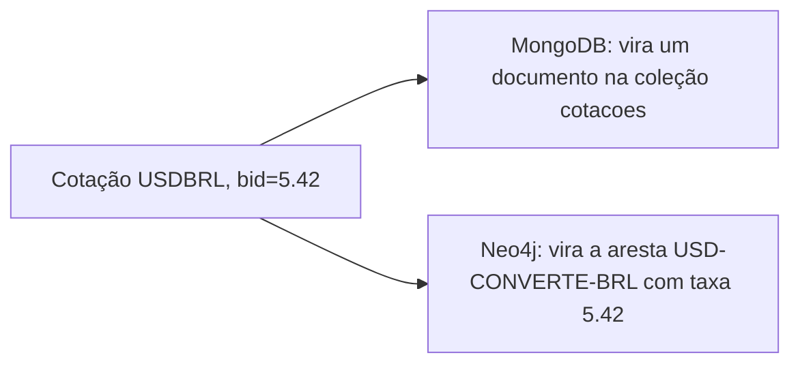

# 03 — Modelagem de dados (o coração da prática)

> Aqui está o ponto pedagógico central: **o mesmo dado**, modelado de duas formas.
> Não há SQL neste projeto — os dois bancos são NoSQL, com filosofias diferentes.

## 1. Objetivo da modelagem

Mostrar como uma única linha da AwesomeAPI (ex.: o par `USD-BRL`) vira:
- um **documento** de histórico no MongoDB, e
- uma **aresta** entre dois nós-moeda no Neo4j.

## 2. Dado de origem (AwesomeAPI)

Endpoint de último valor: `https://economia.awesomeapi.com.br/json/last/USD-BRL,EUR-BRL`

```json
{
  "USDBRL": {
    "code": "USD", "codein": "BRL", "name": "Dólar/Real",
    "high": "5.45", "low": "5.40", "bid": "5.42", "ask": "5.43",
    "pctChange": "-0.31", "create_date": "2026-06-15 13:00:00"
  }
}
```

Endpoint de histórico diário: `https://economia.awesomeapi.com.br/json/daily/USD-BRL/30`
(retorna uma lista com os fechamentos dos últimos 30 dias).

## 3. Modelo A — MongoDB (documento)

**Coleção `cotacoes`** — uma cotação válida = um documento:

```json
{
  "par": "USD-BRL",
  "moeda_origem": "USD",
  "moeda_destino": "BRL",
  "compra": 5.42,
  "venda": 5.43,
  "maxima": 5.45,
  "minima": 5.40,
  "variacao_pct": -0.31,
  "coletado_em": "2026-06-15T13:00:00Z"
}
```

- **Índice:** `(par, coletado_em)` — acelera a pergunta "histórico do par X no tempo".
- **Por que documento?** É flexível e ótimo para **série temporal**: cada coleta é um
  registro independente; agregar por dia/par é natural.

**Coleção `dead_letter`** — cotações rejeitadas pelo filtro:

```json
{ "bruto": { "...": "payload original" }, "motivo": "bid <= 0", "rejeitado_em": "..." }
```

## 4. Modelo B — Neo4j (grafo)

- **Nó:** `(:Moeda { codigo })` — ex.: `(:Moeda {codigo: "USD"})`.
- **Aresta:** `(:Moeda)-[:CONVERTE { taxa, atualizado_em }]->(:Moeda)`.

```cypher
MERGE (origem:Moeda {codigo: $origem})
MERGE (destino:Moeda {codigo: $destino})
MERGE (origem)-[r:CONVERTE]->(destino)
SET r.taxa = $taxa, r.atualizado_em = $ts
```

- **`MERGE`** garante que moedas e arestas **não dupliquem**.
- **Por que grafo?** É ótimo para **relação e caminho**: "qual a melhor sequência de
  conversões de BRL até JPY?" vira um `shortestPath`/caminho ponderado, algo trabalhoso
  no Mongo.

## 5. Padrões obrigatórios

- Códigos de moeda sempre em **MAIÚSCULAS** (chave consistente entre os dois bancos).
- Datas em **UTC ISO-8601** (`...Z`).
- Nome de par no formato `ORIGEM-DESTINO` (ex.: `USD-BRL`).
- Valores numéricos como **float** (a API entrega string; o ingestor converte).

## 6. Como a mesma cotação alimenta os dois bancos



## 7. Consultas de referência (para usar em aula)

**Mongo — média diária do dólar:**
```javascript
db.cotacoes.aggregate([
  { $match: { par: "USD-BRL" } },
  { $group: { _id: { $dateToString: { format: "%Y-%m-%d", date: "$coletado_em" } },
              media_compra: { $avg: "$compra" } } },
  { $sort: { _id: 1 } }
])
```

**Neo4j — caminho de conversão BRL -> JPY:**
```cypher
MATCH p = shortestPath( (:Moeda {codigo:"BRL"})-[:CONVERTE*..5]->(:Moeda {codigo:"JPY"}) )
RETURN p
```

## 8. Pedido para o Agente Arquiteto

Valide esta modelagem, aponte riscos (ex.: direção das arestas, taxa de ida vs. volta) e
sugira simplificações adequadas a iniciantes. Não implemente código aqui.
