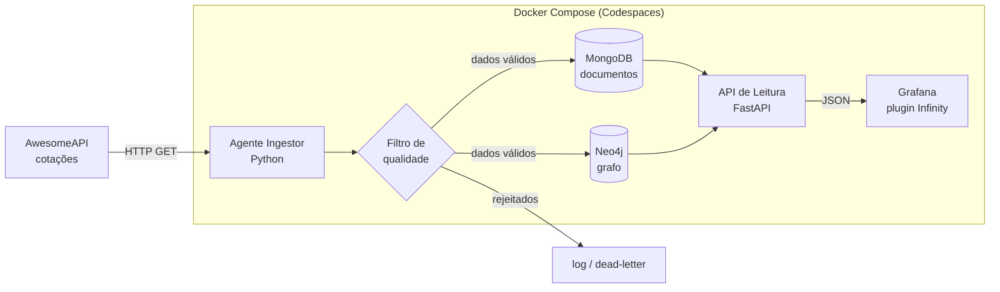

# Roteiro Multiagente — Pipeline de Câmbio com MongoDB + Neo4j + Grafana (Docker / GitHub Codespaces)

> **Objetivo de aula:** mostrar a alunos iniciantes em NoSQL que **o mesmo dado financeiro** pode ser modelado de duas formas radicalmente diferentes — **documento** (MongoDB) e **grafo** (Neo4j) — e que cada modelo responde melhor a perguntas diferentes. Tudo orquestrado por agentes de IA, empacotado em Docker e rodando no GitHub Codespaces, com um dashboard no Grafana no final.

---

## 1. Visão geral em uma frase

Consumimos cotações de moedas da **AwesomeAPI** (gratuita, sem chave, brasileira), aplicamos um **filtro de qualidade**, gravamos os dados **simultaneamente** no MongoDB (como histórico de cotações) e no Neo4j (como grafo de conversão entre moedas), e visualizamos os dois no **Grafana**.

## 2. O insight pedagógico central — por que câmbio é o exemplo perfeito

A AwesomeAPI retorna pares de moedas: `USD-BRL`, `EUR-BRL`, `EUR-USD`, `BTC-BRL`, etc. Isso traz um contraste didático claro:

- **No MongoDB**, cada cotação vira um **documento** — bom para perguntas de série temporal: "como o dólar variou nos últimos 30 dias?".
- **No Neo4j**, cada par vira uma **aresta** entre dois nós-moeda, com a taxa como peso — bom para perguntas de relação e caminho: "qual a melhor sequência de conversões de BRL para JPY?" ou "existe arbitragem entre USD -> EUR -> BRL -> USD?".

Ou seja, a **mesma linha da API** vira coisas completamente diferentes nos dois bancos. Esse é o contraste central que a prática busca evidenciar.

## 3. Arquitetura



**Por que a "API de Leitura" no meio?** O Grafana open-source **não tem** datasource nativo gratuito para MongoDB (o oficial é pago/Enterprise). A solução limpa e 100% gratuita é colocar um FastAPI pequeno que expõe consultas dos dois bancos como JSON, e o Grafana lê tudo pelo plugin **Infinity** (gratuito). Como ganho adicional, os alunos aprendem a camada de API.

## 4. Stack e portas

| Componente | Tecnologia | Porta | Papel |
|---|---|---|---|
| Ingestão + Filtro | Python 3.12 (`requests`, `pydantic`) | — | ETL |
| Banco documento | MongoDB | 27017 | Histórico de cotações |
| Banco grafo | Neo4j | 7474 (UI) / 7687 (Bolt) | Grafo de conversão |
| API de leitura | FastAPI + Uvicorn | 8000 | Expõe consultas como JSON |
| Dashboard | Grafana OSS + plugin Infinity (grafo via Node Graph) | 3000 | Visualização |
| Orquestração | Docker Compose | — | Sobe tudo junto |
| Ambiente | GitHub Codespaces (`.devcontainer`) | — | IDE na nuvem |

## 5. Estrutura de pastas

```
projeto-cambio-nosql/
├── .devcontainer/
│   └── devcontainer.json          # config do Codespaces
├── docker-compose.yml             # orquestra os 5 serviços
├── .env.example                   # variáveis (senhas dos bancos)
├── ingestor/
│   ├── Dockerfile
│   ├── requirements.txt
│   ├── main.py                    # loop de coleta
│   ├── filtros.py                 # regras de qualidade
│   ├── carga_mongo.py             # grava documentos
│   └── carga_neo4j.py             # grava grafo
├── api_leitura/
│   ├── Dockerfile
│   ├── requirements.txt
│   └── main.py                    # endpoints /mongo/* e /neo4j/*
├── grafana/
│   └── provisioning/
│       ├── datasources/datasources.yml
│       └── dashboards/cambio.json
└── README.md                      # roteiro de aula
```

---

## 6. Os agentes de IA

Cada agente recebe uma **missão**, um **prompt-base** e um **critério de pronto** (Definition of Done). Eles podem ser executados em sequência ou divididos entre uma equipe de agentes. O Agente 0 coordena.

### Agente 0 — Orquestrador / Tech Lead
- **Missão:** ler este roteiro, criar a estrutura de pastas, distribuir as tarefas, revisar a integração no final e garantir que `docker compose up` sobe tudo sem erro.
- **Prompt-base:** *"Você é o tech lead deste projeto educacional. Crie a estrutura de pastas conforme a seção 5, gere o `.env.example` e o `README.md` inicial, e ao final integre o trabalho dos demais agentes garantindo que tudo sobe com um único comando no Codespaces."*
- **Pronto quando:** `docker compose up` levanta os 5 serviços e os healthchecks passam.

### Agente 1 — Arquiteto de Infra (Docker + Codespaces)
- **Missão:** escrever `docker-compose.yml`, os `Dockerfile` de cada serviço e o `.devcontainer/devcontainer.json`.
- **Prompt-base:** *"Crie o docker-compose com MongoDB, Neo4j, o serviço ingestor, a api_leitura e o Grafana. Use healthchecks, volumes nomeados para persistência, uma rede interna, e configure o devcontainer para o Codespaces expor as portas 7474, 8000 e 3000."*
- **Pronto quando:** os serviços se enxergam pela rede interna e os dados persistem entre reinícios.

### Agente 2 — Engenheiro de Ingestão
- **Missão:** consumir a AwesomeAPI e normalizar a resposta.
- **Endpoints:** `https://economia.awesomeapi.com.br/json/last/USD-BRL,EUR-BRL,EUR-USD,BTC-BRL,GBP-BRL,JPY-BRL` (última cotação) e `https://economia.awesomeapi.com.br/json/daily/USD-BRL/30` (histórico de 30 dias).
- **Prompt-base:** *"Escreva `ingestor/main.py` que busca as cotações da AwesomeAPI a cada N minutos, trata timeout e erro de rede, e passa cada cotação adiante para o filtro. Converta os campos string ('bid', 'high', 'low') para float e o timestamp para datetime."*
- **Pronto quando:** coleta roda em loop, loga cada ciclo e sobrevive a uma queda momentânea da API.

### Agente 3 — Engenheiro de Qualidade de Dados (o "FILTRO")
- **Missão:** validar e limpar antes de gravar. É aqui que mora o filtro de qualidade.
- **Regras sugeridas (com `pydantic`):** descartar cotação sem campo `bid`; rejeitar `bid <= 0`; rejeitar variação `pctChange` absurda (ex.: > 50% em um tick -> provável erro); descartar duplicata exata (mesmo par + mesmo timestamp); normalizar código da moeda para maiúsculas. O que for rejeitado vai pra um log/coleção "dead-letter" (ótimo para mostrar aos alunos *o que* foi barrado e por quê).
- **Prompt-base:** *"Implemente `filtros.py` com um modelo pydantic `Cotacao` e uma função `validar(cotacao)` que retorna (válido, motivo). Cotações inválidas devem ser registradas, nunca gravadas nos bancos principais."*
- **Pronto quando:** dá pra demonstrar em aula uma cotação boa passando e uma ruim sendo barrada.

### Agente 4 — Engenheiro MongoDB (modelo documento)
- **Missão:** gravar cada cotação válida como documento.
- **Modelo de documento:**
  ```json
  {
    "par": "USD-BRL",
    "moeda_origem": "USD",
    "moeda_destino": "BRL",
    "compra": 5.42,
    "venda": 5.43,
    "maxima": 5.45,
    "minima": 5.40,
    "variacao_pct": -0.31,
    "coletado_em": "2026-06-15T13:00:00Z"
  }
  ```
- **Prompt-base:** *"Implemente `carga_mongo.py` usando pymongo. Crie a coleção `cotacoes` com índice em (`par`, `coletado_em`). Insira um documento por cotação válida. Explique em comentário por que o modelo documento é bom para série temporal."*
- **Pronto quando:** consulta de agregação "média do dólar por dia" funciona.

### Agente 5 — Engenheiro Neo4j (modelo grafo)
- **Missão:** transformar a mesma cotação em grafo.
- **Modelo de grafo:** nós `(:Moeda {codigo})`; arestas `(:Moeda)-[:CONVERTE {taxa, atualizado_em}]->(:Moeda)`.
  ```cypher
  MERGE (origem:Moeda {codigo: $origem})
  MERGE (destino:Moeda {codigo: $destino})
  MERGE (origem)-[r:CONVERTE]->(destino)
  SET r.taxa = $taxa, r.atualizado_em = $ts
  ```
- **Prompt-base:** *"Implemente `carga_neo4j.py` usando o driver oficial neo4j. Use MERGE para não duplicar moedas. Inclua uma query de exemplo de menor caminho de conversão entre duas moedas com `shortestPath`, para usar em aula."*
- **Pronto quando:** dá pra rodar no Neo4j Browser uma busca de caminho BRL -> JPY e ver o grafo.

### Agente 6 — Engenheiro de Visualização (API de leitura + Grafana)
- **Missão:** expor os dados e montar o dashboard.
- **API de leitura (FastAPI):** `/mongo/serie?par=USD-BRL` (série temporal pro Grafana), `/mongo/resumo` (cards), `/neo4j/grafo` (nós e arestas), `/neo4j/caminho?de=BRL&para=JPY`.
- **Grafana provisionado:** datasource Infinity apontando para `http://api_leitura:8000`; painéis: (1) linha temporal das moedas, (2) cards com cotação atual e variação, (3) tabela de pares, (4) painel com o grafo via Node Graph.
- **Prompt-base:** *"Crie `api_leitura/main.py` (FastAPI) com os endpoints acima retornando JSON pronto para o Grafana Infinity, e provisione datasource + dashboard via arquivos em `grafana/provisioning/`. O dashboard deve subir já populado, sem clique manual."*
- **Pronto quando:** ao abrir a porta 3000 no Codespaces, o dashboard já aparece com dados.

### Agente 7 — Documentador / QA Didático
- **Missão:** escrever o README como **roteiro de aula** e validar o passo a passo num ambiente limpo.
- **Prompt-base:** *"Escreva o README explicando, para um aluno que nunca viu NoSQL, o que é cada serviço, como subir tudo no Codespaces, e inclua a tabela comparativa Mongo vs Neo4j da seção 10 deste roteiro. Teste o fluxo do zero."*
- **Pronto quando:** um aluno consegue, só pelo README, subir o projeto e responder uma pergunta em cada banco.

---

## 7. Esboço do `docker-compose.yml`

```yaml
services:
  mongo:
    image: mongo:7
    ports: ["27017:27017"]
    volumes: ["mongo_data:/data/db"]
    healthcheck:
      test: ["CMD", "mongosh", "--quiet", "--eval", "db.adminCommand('ping').ok"]
      interval: 10s

  neo4j:
    image: neo4j:5
    environment:
      NEO4J_AUTH: neo4j/${NEO4J_PASSWORD}
    ports: ["7474:7474", "7687:7687"]
    volumes: ["neo4j_data:/data"]
    healthcheck:
      test: ["CMD-SHELL", "wget -qO- http://localhost:7474 >/dev/null 2>&1 || exit 1"]
      interval: 10s

  ingestor:
    build: ./ingestor
    depends_on:
      mongo: { condition: service_healthy }
      neo4j: { condition: service_healthy }
    environment:
      MONGO_URI: mongodb://mongo:27017
      NEO4J_URI: bolt://neo4j:7687
      NEO4J_PASSWORD: ${NEO4J_PASSWORD}

  api_leitura:
    build: ./api_leitura
    ports: ["8000:8000"]
    depends_on:
      mongo: { condition: service_healthy }
      neo4j: { condition: service_healthy }

  grafana:
    image: grafana/grafana-oss:11.1.0
    ports: ["3000:3000"]
    environment:
      GF_INSTALL_PLUGINS: yesoreyeram-infinity-datasource
    volumes:
      - ./grafana/provisioning:/etc/grafana/provisioning

volumes:
  mongo_data:
  neo4j_data:
```

## 8. `.devcontainer/devcontainer.json` (Codespaces)

```json
{
  "name": "cambio-nosql",
  "image": "mcr.microsoft.com/devcontainers/python:3.12",
  "features": {
    "ghcr.io/devcontainers/features/docker-in-docker:2": {}
  },
  "forwardPorts": [3000, 7474, 7687, 8000],
  "postCreateCommand": "echo 'Ambiente pronto. Rode: cp .env.example .env && docker compose up --build'"
}
```

## 9. O "filtro" em detalhe (para discutir em aula)

| Regra | Por que existe | Exemplo do que barra |
|---|---|---|
| `bid` presente e > 0 | dado financeiro sem preço é inútil | cotação vazia da API |
| variação ≤ limite | tick com erro grosseiro polui o gráfico | dólar a R$ 0,01 ou R$ 9.999 |
| sem duplicata (par+timestamp) | evita inflar contagens | mesma coleta gravada 2x |
| código em maiúsculo | consistência de chave no grafo | "usd" vs "USD" |

Mostre aos alunos a coleção *dead-letter*: nada ensina filtro melhor do que ver o lixo que ele segurou.

## 10. Comparação MongoDB vs Neo4j (o coração da aula)

| Critério | MongoDB (documento) | Neo4j (grafo) |
|---|---|---|
| Unidade de dado | Documento JSON | Nós + arestas |
| A cotação USD-BRL é... | uma linha do histórico | uma aresta de USD para BRL |
| Pergunta que ele responde bem | "Como o dólar variou em 30 dias?" | "Qual o melhor caminho de BRL até JPY?" |
| Linguagem | MQL / Aggregation Pipeline | Cypher |
| Pergunta difícil pra ele | "Caminho entre 3 moedas" (precisa de vários joins) | "Média diária" (não é o forte) |
| Brilha em | Volume, série temporal, flexibilidade de schema | Relações, caminhos, conexões |

**Atividade sugerida:** dê a mesma pergunta para os dois bancos e deixe os alunos sentirem qual é fácil e qual é difícil em cada um.

## 11. Painéis do Grafana

1. **Série temporal** — linha do USD-BRL, EUR-BRL, etc. nos últimos 30 dias (do Mongo).
2. **Cards (Stat panel)** — cotação atual e variação % de cada moeda.
3. **Tabela** — todos os pares com compra/venda/máxima/mínima.
4. **Grafo** — nós-moeda e arestas de conversão (do Neo4j, via Node Graph panel).

## 12. Roteiro de aula sugerido (sequência didática)

1. Abrir o Codespace e rodar `docker compose up` — todos veem os 5 serviços subindo.
2. Mostrar a resposta crua da AwesomeAPI no navegador.
3. Mostrar a mesma cotação **dentro do Mongo** (documento) e **dentro do Neo4j** (grafo).
4. Rodar uma agregação no Mongo e um `shortestPath` no Neo4j — sentir a diferença.
5. Abrir o Grafana e mostrar os dois bancos visualizados lado a lado.
6. Discutir: "quando você usaria cada um na vida real?".

## 13. Extensões / desafios para alunos avançados

- Detectar **arbitragem** (ciclo lucrativo) no grafo do Neo4j.
- Adicionar mais moedas e ver o grafo crescer.
- Criar alerta no Grafana quando o dólar passar de um limite.
- Comparar performance: a mesma pergunta nos dois bancos, qual responde mais rápido?

---

### Checklist final do Orquestrador
- [ ] `docker compose up` sobe tudo no Codespaces
- [ ] Ingestor coleta e o filtro barra dados ruins
- [ ] Mongo tem documentos; Neo4j tem grafo
- [ ] API de leitura responde JSON
- [ ] Grafana abre na porta 3000 já com dashboard populado
- [ ] README permite um aluno reproduzir do zero
